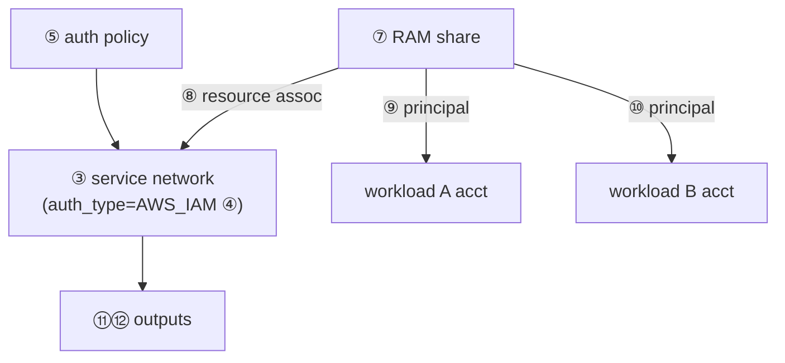

# crit-explain

Turn a diff into a guided reading experience: a reviewer opens crit and, by reading the numbered comments in order, understands the whole change from its dependency root outward — not by scanning files top-to-bottom.

## Core principles (non-negotiable)

- **Explain, don't critique** — explain WHAT each resource/definition does and WHY it exists. Do not hunt for problems or critique. (For critique use `$critique`/`/code-review`.)
- **Japanese comment prose** — write the explanatory prose in Japanese; section headings and role labels use the English templates below. Code, identifiers, commands stay verbatim.
- **Map structure is mandatory** — always produce (a) one review-level overview comment and (b) dependency-ordered numbered line comments ①②③…. Never a flat pile of unordered notes.
- **Lead with a diagram** — the overview comment must embed at least one unicode box-art diagram that makes the structure graspable at a glance. Text alone is not enough. Generate it locally with `scripts/mermaid_to_boxart.py` (crit does not render mermaid).
- **Comments only** — never edit `.tf`/source files, never commit/push. Annotations live in crit, not in code.
- **`--author 'Claude Code'`** on every comment.

## Inputs / target detection

Mirror `crit`'s auto-detection. Pass the user's argument straight through:

- no arg → current branch diff (`crit`)
- `--range <base>..<head>` → commit range
- `--pr <num|url>` → GitHub PR
- explicit files/dir → those paths

Use the SAME target for reading the diff and for launching crit, so comment line numbers line up.

## Workflow

### 1. Read the diff and build the dependency chain

- Get the changed files (`git diff --stat <range>` or `git diff <range> -- <path>`), then read the core files in full.
- Identify the **dependency root** — the resource everything else references (e.g. the primary resource other resources point their `*_arn`/`*_id`/`resource_identifier` at) — and trace outward: prerequisites → central resource → things attached to it → things sharing/exposing it → outputs consumed downstream.
- **Auto-select core resources**: the resource definitions that carry the change's intent. Skip noise (lockfiles, `Makefile`, `Dockerfile`, `.gitignore`, generated backend files) — reference them only in the overview map, don't line-comment them.
- Read neighboring context files (e.g. `locals.tf`, referenced variables) so comments are accurate, even if they aren't commented on.

### 2. Author the comments via crit-cli

Read the `crit:crit-cli` skill for exact CLI syntax. Author everything in one atomic `--json` batch. Write the JSON to a temp file (bodies are multi-line Japanese) and run:

```bash
crit comment --json --file <tmp>.json --author 'Claude Code'
```

**a. Overview comment (`scope: "review"`)** — the map. Structure it with these sections:

- `## Background` — why this change exists / what problem it addresses
- `## Structure` — **at least one unicode box-art diagram** visualizing the structure (see below). Put it early so the reader gets the shape before the prose.
- `## Overview` — the shape of the change; if multi-component, how the pieces relate
- `## File roles` — one line per changed file (including the noise files, so the reader knows what to skip)
- `## Key points` — the 3–5 things that actually matter (key flags, guards, invariants, "CP1 is loose, CP2 tightens" style notes)
- `## Reading order` — the dependency-ordered route, naming the numbered anchors: `① prerequisite → ③ center → ⑤ … → ⑪ handoff`

State explicitly that the ①-⑫ prefixes on line comments follow this route.

**Box-art diagram (required).** Author the structure as a Mermaid **flowchart**, convert it to static unicode box-art with the bundled local script, and paste the OUTPUT into the comment inside a plain ```` ``` ```` fence. Crit does not render mermaid — box-art renders anywhere monospace, so the diagram must be pre-rendered. See `references/boxart.md` for the supported subset and limits.

Authoring the flowchart:
- **Dependency / relationship graph** (`flowchart TD` or `graph LR`) — the default and the only shape the converter renders. Show core resources as nodes and their references as edges (who points its `*_arn`/`*_id` at whom), and tag each node with its reading number so the diagram doubles as the route: `SN["③ service_network"]`. `subgraph` borders are NOT drawn — encode cross-boundary grouping (accounts, VPCs, stacks) in the node label, e.g. `SN["③ service network (owner)"]`.
- Keep labels short (use `<br/>` for a second line); put Japanese explanation in the node text, not in comments.
- Prefer one clear diagram of <= ~10 nodes; the reading route must be reinforced by the layout, not contradicted.
- For a genuinely sequence- or state-shaped change, hand-author the box-art directly (still inside a plain ```` ``` ```` fence); the converter only does flowcharts.

Convert (write the flowchart to a temp `.mmd`, then run the skill-local script):

```bash
python3 <skill-dir>/scripts/mermaid_to_boxart.py /tmp/diagram.mmd
```

Embed the STDOUT verbatim in the overview body inside a plain ```` ``` ```` fence (JSON-escape the newlines for the `--json` batch).

Example — this flowchart:



converts to the box-art you paste (plain fence):

```
                 ┌───────────────┐    ┌─────────────┐
                 │ ⑤ auth policy │    │ ⑦ RAM share │
                 └───────────────┘    └─────────────┘
            ┌────────────┘                   │
            ┌────────────────────────────────│ ⑧ resource assoc
            │                         ┌──────│ ⑨ principal
            │                         │      └───────────────┐ ⑩ principal
            ▼                         ▼                      ▼
┌───────────────────────┐    ┌─────────────────┐    ┌─────────────────┐
│   ③ service network   │    │ workload A acct │    │ workload B acct │
│ (auth_type=AWS_IAM ④) │    └─────────────────┘    └─────────────────┘
└───────────────────────┘
            └──────────────────────┐
                                   ▼
                            ┌────────────┐
                            │ ⑪⑫ outputs │
                            └────────────┘
```

**b. Line comments** — one per core resource, in dependency-chain order. Each body:

- starts with the circled number + a role label: `[① Prerequisite: …]`, `[③ Dependency center: …]`, `[⑪ Downstream handoff: …]`
- explains WHAT + WHY concisely
- ends with a navigation pointer to the next step: `→ next: ⑤` (omit on the last one; instead close the loop, e.g. "loop complete")
- anchors to real file line numbers (1-indexed, on-disk), single line or `start-end` range

Number continuously across files following the reading route, not the file listing order.

### 3. Launch crit in the background and relay the URL

Read the `crit:crit` skill. Launch with `run_in_background: true`, using the same target:

```bash
crit                      # or: crit --range <base>..<head> / crit --pr <n>
```

Wait for the `http://localhost:<port>` line, then relay it verbatim:

> **Crit is open at http://localhost:<port>. Read the ①-⑫ comments in order to grasp the whole change.**

If a comment batch was written before the daemon started, it may land in a different review file than the running session — verify with `crit comments --json` against the live daemon and re-add if empty (see Gotchas).

### 4. Report

List every comment added as `file:line — one-line topic`, plus the overview. Note that source files were not modified.

## Gotchas

- **Review-file mismatch**: `crit comment` targets the active daemon session when one is running, but the branch-diff review file and a `--range` review file differ. If you commented *before* launching, `crit comments --json` on the live session may return `null`/empty — re-run the same `--json` batch after the daemon is up. Confirm with `crit status`.
- **No edit command**: to revise bodies, `crit comment --clear` then re-add the full batch. There is no per-comment body edit.
- **Bulk atomicity**: always use one `--json` batch for 3+ comments (single write, no partial state).

## Hard constraints

- Do not edit or modify any source file.
- Do not `git commit`/`push`, and do not write to any issue tracker or notes.
- Comment only on the core resources that carry the change's intent.
