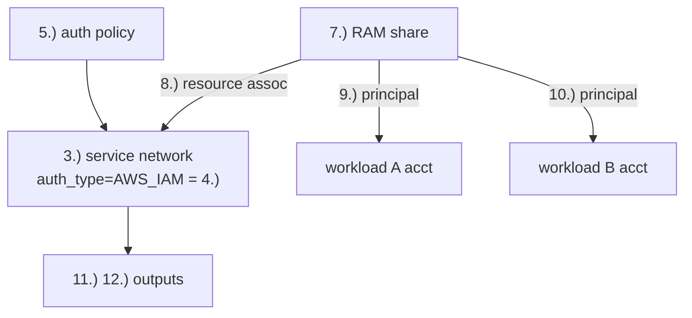

# crit-explain

Turn a diff into a guided reading experience: a reviewer opens crit and, by reading the numbered comments in order, understands the whole change from its dependency root outward — not by scanning files top-to-bottom.

## Core principles (non-negotiable)

- **Explain, don't critique** — explain WHAT each resource/definition does and WHY it exists. Do not hunt for problems or critique. (For critique use `$critique`/`/code-review`.)
- **Japanese comment prose** — write the explanatory prose in Japanese; section headings and role labels use the English templates below. Code, identifiers, commands stay verbatim.
- **Map structure is mandatory** — always produce (a) one review-level overview comment and (b) dependency-ordered numbered line comments prefixed with a grep-friendly ASCII token — `1.)` `2.)` `3.)` … (not circled glyphs like ①②③, which are hard to grep and type). Never a flat pile of unordered notes.
- **Lead with a diagram** — the overview comment must embed at least one unicode box-art diagram that makes the structure graspable at a glance. Text alone is not enough. Generate it locally with `scripts/mermaid_to_boxart.py` (crit does not render mermaid).
- **Comments only** — never edit `.tf`/source files, never commit/push. Annotations live in crit, not in code.
- **`--author 'Claude Code'`** on every comment.
- **Lock the target and base, keep them sticky** — establish the review mode and base up front, asking the user when either is not explicit, then reuse the SAME invocation for every crit (re)launch: `--range <base>..HEAD` for a range review, or `<file> --base-branch <ref>` for a single document. Never use `crit --session` (which silently re-derives the diff against the repo main branch).
- **Persist by default, re-persist on every change** — the crit session is volatile; snapshot the review into `<worktree-root>/.local/crit/` after the initial authoring AND after every subsequent mutation (each reply, `--clear`+re-add, resolve, surgical `review.json` edit). For every comment mutation, stop the daemon before writing, relaunch, validate, then snapshot. The snapshot must always reflect the latest state. Not optional.

## Inputs / target detection

Mirror `crit`'s auto-detection. Pass the user's argument straight through:

- no arg → current branch diff (`crit`)
- `--range <base>..<head>` → commit range
- `--pr <num|url>` → GitHub PR
- explicit files/dir → those paths

Use the SAME target for reading the diff and for launching crit, so comment line numbers line up.

**Ask for the target and base when either is not explicit.** If the user did not pass an
explicit `--range`/`--pr`/paths (e.g. "explain this diff", or a bare branch), do not
silently default to the branch-vs-main diff — confirm both the review scope and base.
Record the selected invocation and reuse it exactly on every relaunch so neither the
scope nor base drifts.

**Single artifact document — select explicit file + base branch.** To annotate a design
plan, report, or other one-file Markdown artifact in full, do not use `crit plan` or
`--range`: a range includes every file changed in that range. Find the commit that first
added the document, create a ref at its parent without checkout, then launch the named
file with that ref as its base. The document becomes the sole added diff and every line
can be anchored. `crit plan --name <slug> <file>` is only for reviewing the diff between
successive document versions.

```bash
WT=$(git rev-parse --show-toplevel)
(cd "$WT" && git log --oneline --diff-filter=A -- '<file>')  # identify the add commit
(cd "$WT" && git branch -f crit-base <that-commit>^)         # creates/updates a ref; no checkout
(cd "$WT" && crit '<file>' --base-branch crit-base)
```

Keep `crit-base` for the entire review, including every restart. After the review is
fully complete, delete it with `(cd "$WT" && git branch -D crit-base)`; retain it when the persisted
review may be restored later, and put its recreation command in the restore note.

**Range review — select `--range`.** Use `crit --range <BASE>..HEAD` only when every
file changed in that range belongs in the review (for example, a normal branch review).

## Workflow

### 1. Read the diff and build the dependency chain

- Before opening a review containing a non-ASCII filename, run `git config core.quotePath false`.
  With `core.quotePath` true, crit receives octal-escaped paths and cannot parse their diff;
  the live session then reports `additions: 0` for that file.
- Get the changed files using the locked scope (`git diff --stat <BASE>..HEAD` for a range, or `git diff crit-base -- '<file>'` for a single artifact), then read the core files in full.
- Identify the **dependency root** — the resource everything else references (e.g. the primary resource other resources point their `*_arn`/`*_id`/`resource_identifier` at) — and trace outward: prerequisites → central resource → things attached to it → things sharing/exposing it → outputs consumed downstream.
- **Auto-select core resources**: the resource definitions that carry the change's intent. Skip noise (lockfiles, `Makefile`, `Dockerfile`, `.gitignore`, generated backend files) — reference them only in the overview map, don't line-comment them.
- Read neighboring context files (e.g. `locals.tf`, referenced variables) so comments are accurate, even if they aren't commented on.

### 2. Discover and lock the session identity, then stop the daemon

Read the `crit:crit` skill. Launch with `run_in_background: true` only to discover the
canonical paths, session id, and served base. Do not author while this daemon runs:

```bash
WT=$(git rev-parse --show-toplevel)
(cd "$WT" && crit --range <BASE>..HEAD)                 # range review
(cd "$WT" && crit '<file>' --base-branch crit-base)     # single artifact review
# or: (cd "$WT" && crit --pr <n>)                        (never crit --session <id>)
```

Wait for the `http://localhost:<port>` line, but do not relay it yet: it is only the
temporary discovery URL. The required restart changes the port.

This discovery launch establishes the session id — hence the persist path that Step 3's
`## Session` block must carry — and lets `/api/session` determine the canonical line
comment paths. It does not make daemon-running authoring safe.

With the daemon up, resolve and record the identity before authoring anything:

```bash
REVFILE=$(cd "$WT" && crit status --json | python3 -c 'import json,sys;print(json.load(sys.stdin)["review_file"])')
```

Derive `SID=$(basename "$(dirname "$REVFILE")")` and the persist destination
`<worktree-root>/.local/crit/$SID/review.json`. Verify the served base now, not later
(see the base-verification gotcha): the live truth is `/api/session`, not `review.json`.

Before preparing the JSON batch, read `/api/session` and record every `.files[].path`;
those are the only canonical `file` values for line comments. Require `len(.files)` to
equal the intended target count. For a single artifact document, that count is one, and
its entry must have `additions > 0` and no `orphaned` field before authoring. A path in
the form `"\\360\\237..."` is an octal-escaped non-ASCII path: run
`git config core.quotePath false`, then relaunch the same invocation.

```bash
PID=$(pgrep -f 'crit _serve' | head -1)
PORT=$(lsof -a -p "$PID" -iTCP -sTCP:LISTEN -P -n | awk 'END{split($9,a,":");print a[2]}')
curl -s "http://localhost:$PORT/api/session" | python3 -c '
import json,sys
d=json.load(sys.stdin)
for f in d.get("files", []):
    print(f["path"], f.get("additions"), f.get("orphaned"), f.get("comment_count"))
print("review_comments", len(d.get("review_comments", [])))
'
```

Any time the daemon is restarted (after `crit stop`, a config fix, etc.), reopen with
the SAME locked invocation — not `--session` — and re-verify the target and base.

After recording the identity and pre-authoring session facts, stop the daemon before
any `crit comment` call:

```bash
(cd "$WT" && crit stop)
```

Confirm that no `crit _serve` process remains. Do not proceed to Step 3 while a daemon
is running.

### 3. Author the comments via crit-cli

Read the `crit:crit-cli` skill for exact CLI syntax. With the daemon stopped, author
everything in one atomic `--json` batch. Write the JSON to a temp file (bodies are
multi-line Japanese) and run:

```bash
(cd "$WT" && crit comment --json --file <tmp>.json --author 'Claude Code')
```

Put the exact Step 2 served path in every line comment's `file` field. This same stopped
daemon rule applies to line comments, review comments, and replies. Restart with the
SAME locked invocation, never `crit plan`, then verify the final daemon session:

- Require the expected `.files` count, each target's `.comment_count > 0`,
  `.additions > 0`, no `orphaned` field, and the expected `review_comments` count.
- Verify the expected total replies after restart (not immediately after writing):

  ```bash
  (cd "$WT" && crit comments --all --json) | python3 -c '
  import json,sys
  print("replies:", sum(len(c.get("replies") or []) for c in json.load(sys.stdin)))
  '
  ```

  If the review-scope comment is absent from a mixed batch, or the reply total is short,
  stop the daemon again, submit only the missing item, then relaunch and re-verify.

Only after all validation passes, relay the URL from this final daemon launch verbatim:

> **Crit is open at http://localhost:<port>. Read the 1.) 2.) 3.) … comments in order to grasp the whole change.**

Every daemon restart changes the port and invalidates any previously relayed URL. Relay
the newly launched URL again after each later restart.

**a. Overview comment (`scope: "review"`)** — the map. Structure it with these sections:

- `## Session` — **required, placed first (right after the H1 title)**. Two lines: the absolute path of the persisted snapshot (`<worktree-root>/.local/crit/<session-id>/review.json`, resolved in Step 2) and the locked review invocation (`<BASE>..HEAD`, or `<file> --base-branch <ref>`). This makes the target, base, and persistence location visible to any reader opening the review. Because Step 2 already resolved the session id, write the real values here on the first pass — no backfill. Keep it in sync if either changes (re-run the surgical edit).
- `## Background` — why this change exists / what problem it addresses
- `## Structure` — **at least one unicode box-art diagram** visualizing the structure (see below). Put it early so the reader gets the shape before the prose.
- `## Overview` — the shape of the change; if multi-component, how the pieces relate
- `## File roles` — one line per changed file (including the noise files, so the reader knows what to skip)
- `## Key points` — the 3–5 things that actually matter (key flags, guards, invariants, "CP1 is loose, CP2 tightens" style notes)
- `## Reading order` — the dependency-ordered route, naming the numbered anchors: `1.) prerequisite → 3.) center → 5.) … → 11.) handoff`

State explicitly that the `1.)` `2.)` `3.)` … prefixes on line comments follow this route.

**Box-art diagram (required).** Author the structure as a Mermaid **flowchart**, convert it to static unicode box-art with the bundled local script, and paste the OUTPUT into the comment inside a plain ```` ``` ```` fence. Crit does not render mermaid — box-art renders anywhere monospace, so the diagram must be pre-rendered. See `references/boxart.md` for the supported subset and limits.

Authoring the flowchart:
- **Dependency / relationship graph** (`flowchart TD` or `graph LR`) — the default and the only shape the converter renders. Show core resources as nodes and their references as edges (who points its `*_arn`/`*_id` at whom), and tag each node with its reading number so the diagram doubles as the route: `SN["3.) service_network"]`. `subgraph` borders are NOT drawn — encode cross-boundary grouping (accounts, VPCs, stacks) in the node label, e.g. `SN["3.) service network (owner)"]`.
- Keep labels short (use `<br/>` for a second line); put Japanese explanation in the node text, not in comments.
- Prefer one clear diagram of <= ~10 nodes; the reading route must be reinforced by the layout, not contradicted.
- For a genuinely sequence- or state-shaped change, hand-author the box-art directly (still inside a plain ```` ``` ```` fence); the converter only does flowcharts.

Convert (write the flowchart to a temp `.mmd`, then run the skill-local script):

```bash
python3 <skill-dir>/scripts/mermaid_to_boxart.py /tmp/diagram.mmd
```

Before conversion, render every authored Mermaid source with
`npx -y @mermaid-js/mermaid-cli -i /tmp/diagram.mmd -o /tmp/diagram.svg`; require
exit 0 and the SVG. Do not write a dotted-edge label with a dot inside
`-.text.->` (for example `-.Phase1.5.->`): use `-.->|"Phase 1.5"|` or remove the
dot. HTML tags in edge labels, parentheses inside a node shape, and `<br/>` in
labels are supported forms and do not need avoidance.

Embed the STDOUT verbatim in the overview body inside a plain ```` ``` ```` fence (JSON-escape the newlines for the `--json` batch).

Example — this flowchart:


```mermaid
flowchart TD
  AP["5.) auth policy"] --> SN["3.) service network<br/>auth_type=AWS_IAM = 4.)"]
  RS["7.) RAM share"] -->|"8.) resource assoc"| SN
  RS -->|"9.) principal"| A["workload A acct"]
  RS -->|"10.) principal"| B["workload B acct"]
  SN --> OUT["11.) 12.) outputs"]
```

converts to the box-art you paste (plain fence):

```
                ┌─────────────────┐    ┌───────────────┐
                │ 5.) auth policy │    │ 7.) RAM share │
                └─────────────────┘    └───────────────┘
             ┌───────────┘                     │
             ┌─────────────────────────────────│ 8.) resource assoc
             │                          ┌──────│ 9.) principal
             │                          │      └───────────────┐ 10.) principal
             ▼                          ▼                      ▼
┌─────────────────────────┐    ┌─────────────────┐    ┌─────────────────┐
│   3.) service network   │    │ workload A acct │    │ workload B acct │
│ auth_type=AWS_IAM = 4.) │    └─────────────────┘    └─────────────────┘
└─────────────────────────┘
             └──────────────────────┐
                                    ▼
                          ┌───────────────────┐
                          │ 11.) 12.) outputs │
                          └───────────────────┘
```

**b. Line comments** — one per core resource, in dependency-chain order. Each body:

- starts with the grep-friendly number prefix + a role label: `1.) [Prerequisite: …]`, `3.) [Dependency center: …]`, `11.) [Downstream handoff: …]` (prefix leads the body so `grep '^3\.)'` jumps straight to it)
- explains WHAT + WHY concisely
- ends with a navigation pointer to the next step: `→ next: 5.)` (omit on the last one; instead close the loop, e.g. "loop complete")
- anchors to real file line numbers (1-indexed, on-disk), single line or `start-end` range

Number continuously across files following the reading route, not the file listing order.

### 4. Persist the review (default)

The daemon and its review file under `~/.crit/reviews/` are volatile — snapshot the session into the target worktree so the annotated reading map survives daemon death. Do this by default; do not ask.

```bash
WT=$(git rev-parse --show-toplevel)
REVFILE=$(cd "$WT" && crit status --json | python3 -c 'import sys,json;print(json.load(sys.stdin)["review_file"])')
SID=$(basename "$(dirname "$REVFILE")")
DEST="$WT/.local/crit/$SID"
mkdir -p "$DEST"
cp "$REVFILE" "$DEST/review.json"
printf '*\n' > "$WT/.local/.gitignore"   # keep the snapshot out of git
```

- Snapshot the live `review.json` to `<worktree-root>/.local/crit/<session-id>/review.json`.
- Write `<worktree-root>/.local/.gitignore` = `*` so the snapshot is never accidentally committed.
- Drop a short restore note next to it: session id, `base_ref`, and the restore command. For an explicit-file review, also record `git branch -f crit-base <add-commit>^` so a retained or recreated ref is available before restore.
- **Restore** = copy `review.json` back to `~/.crit/reviews/<session-id>/review.json`, then re-run the same locked invocation (never `--session`).
- **Re-persist on every change (explicit flow)**: the snapshot is point-in-time, so re-run this copy after *any* session mutation — the initial `--json` batch, every reply you post, every reviewer reply you fetch/answer, any `--clear`+re-add, any resolve, and any surgical `review.json` edit. Treat `stop → author/edit → relaunch → validate → copy` as one unit of work; never leave the persisted copy stale.
- **Recovery only — commented before discovery?** Following Step 2 → Step 3 order, the session id is known before authoring, so `## Session` is already correct and nothing needs patching. If a batch was written before the discovery launch, two repairs are needed: (a) it may have landed in a different review file, so inspect `(cd "$WT" && crit comments --json)` after discovery; if it is `null`/empty, stop the daemon and re-run the same `--json` batch while stopped, then relaunch and validate; (b) `## Session` carries a placeholder, so patch it with the surgical `review.json` edit (`(cd "$WT" && crit stop)` → edit → relaunch with the same locked invocation → re-persist).

### 5. Report

List every comment added as `file:line — one-line topic`, plus the overview. State the locked invocation and persist path, then relay the final verified URL. Note that source files were not modified.

## Gotchas

- **Comment paths and delivery must be verified by the daemon**: crit keys line comments by the diff's **repo-root-relative** paths (e.g. `aws/infrastructure/sandbox-lattice/workload-a/lattice.tf`). Always use the exact `.files[].path` from `/api/session`; cwd-relative paths can be stored but do not attach to the diff. `(cd "$WT" && crit comments --json)` reads only the file layer, so it is not a delivery check. After authoring and relaunching the same invocation, use `/api/session` and require the expected `.files` count, the target `.comment_count > 0`, `.additions > 0`, no `orphaned` field, and the expected `review_comments` count; separately require the expected reply total from `(cd "$WT" && crit comments --all --json)`.
- **Run every crit subcommand from the repository root**: `status`, `stop`, `comment`, and `comments` resolve a session from cwd and branch. Set `WT=$(git rev-parse --show-toplevel)` and invoke each as `(cd "$WT" && crit <subcommand> ...)`; do not assume cwd persists between agent commands. Outside the repository, `crit status --json` can report `daemon.running: false` and a nonexistent `review_file`, and `crit stop` can fail with `no running daemon found for current directory and branch`; neither result means the actual session is broken.
- **Relayed URLs expire on restart**: every daemon restart changes the port. Do not relay the initial launch URL as the review URL; after the final restart and daemon validation, relay the current URL. If a later restart is needed, the previous URL is invalid and the new URL must be relayed again.
- **Stop before every `crit comment` write**: a daemon writes its in-memory copy back on `crit stop`. A `crit comment` write made while it runs can be overwritten and lost at stop even when it reports `Added N comments` and the on-disk file initially shows the new content. Always stop the daemon before authoring line comments, review comments, or replies, then relaunch and validate. Existing-comment `reply_to` additions are especially vulnerable because the daemon can hold the parent comment in memory. Verify only after restart: an immediate file read cannot detect this loss.
- **Choose the scope before launching**: `--range` serves every changed file in the range; use it only when that full range is the review target. In a vault or monorepo it can include unrelated files. Adding a path argument to `crit --range <base>..HEAD <file>` is silently ignored even though the path appears in the serve argv, and `ignore_patterns` does not filter `--range`. To review one document in full, make `crit-base` point to the document-addition commit's parent with `git branch -f crit-base <add-commit>^`, then run `(cd "$WT" && crit '<file>' --base-branch crit-base)`.
- **Do not use plan mode for a single document**: `crit plan --name <slug> <file>` reviews the diff between document versions. When that diff is zero, line comments have no anchor, become `orphaned: true`, and appear in the UI as a duplicate `status: removed` file entry. Inspect raw `/api/session` JSON for `orphaned`. Every `crit plan --name <slug>` invocation also creates a new version (v001, v002, …); editing the artifact then rerunning it marks older comments outdated. Do not invoke it only to restart the daemon. For a full-document review, use the explicit-file `--base-branch` invocation above.
- **Plan snapshots cannot be repaired by hand**: changing `~/.crit/plans/<slug>/.crit/snapshots.json` does not create a usable diff because the daemon regenerates snapshots at startup.
- **Non-ASCII paths require `core.quotePath=false`**: with `core.quotePath` true, git emits paths such as `"\\360\\237..."`; crit cannot parse the diff, so `/api/session` reports that file with `additions: 0`. Run `git config core.quotePath false` before launching, then confirm the live `.files[].path` is readable and `.additions > 0`.
- **`review.json`'s `base_ref` is NOT the served target — verify the base against `/api/session`**: the file-layer `base_ref` and the target the daemon actually serves are separate values, and they disagree **in both directions**. `crit --session <id>` re-derives the served diff against the repo main branch while `review.json` still stores the correct base (the UI shows "against master" — always relaunch with the same locked invocation instead). The reverse also happens: `review.json` never stores the ref you passed — it stores a *resolved sha*, measured to be the merge-base against `origin/master`, whose diff can span an order of magnitude more commits than your base while the daemon serves the right range. Reading `review.json` alone in that case produces a false "the base was dropped" alarm. Do not fix this by comparing the sha to a merge-base you compute yourself — that mapping is not guaranteed to hold. The live truth is the daemon:

  ```bash
  ps aux | grep 'crit _serve'                    # confirm the locked invocation is on the argv
  PORT=$(lsof -a -p <serve-pid> -iTCP -sTCP:LISTEN -P -n | awk 'END{split($9,a,":");print a[2]}')
  curl -s "http://localhost:$PORT/api/session"   # .base_ref = served base, .files = served file list
  ```

  For a range, base is correct when `/api/session` `.base_ref` equals `<BASE>` **and** `len(.files)` matches `git diff --stat <BASE>..HEAD`. For an explicit-file `--base-branch` review, require the expected file count (one for a single document), its readable path, `additions > 0`, and no `orphaned` field. Do not report a base problem on `review.json` evidence alone.
- **Bare flags become comment bodies**: `(cd "$WT" && crit comment <anything-unrecognized>)` is treated as adding a review comment with that text — e.g. `crit comment --help` posts a comment whose body is `--help`. Read help via `(cd "$WT" && crit --help)` (or `crit <subcmd> --help` only if documented), never `crit comment --help`.
- **No per-comment delete — surgical fix**: `(cd "$WT" && crit comment --clear)` removes ALL comments (including the reviewer's), so it is unusable once a review round has started. To remove junk or re-path specific comments without data loss: `(cd "$WT" && crit stop)` → back up and edit `~/.crit/reviews/<session-id>/review.json` directly (re-key `files.<path>` entries, drop unwanted `review_comments`) → relaunch with the same locked invocation. Never edit `review.json` while the daemon is running — it owns the file and will clobber your edit on the next mutation.
- **Re-anchor after the reviewed file changes**: do not use `crit comment --clear`, because it removes human replies. Stop the daemon, edit each affected comment's `start_line` and `end_line` in `review.json`, delete its `anchor` and `drifted` fields because they refer to the old text, then relaunch with the same locked invocation. This preserves comment ids and their `replies`.
- **Review-file mismatch**: the branch-diff review file and a `--range` review file differ. If a batch was written before discovery, `(cd "$WT" && crit comments --json)` for the discovered session may return `null`/empty. Stop the daemon, re-run the same `--json` batch while stopped, then relaunch and validate. Confirm the discovered session with `(cd "$WT" && crit status)`.
- **No edit command**: to revise bodies, stop the daemon, then run `(cd "$WT" && crit comment --clear)` and re-add the full batch (clears everything — see the surgical-fix note above for revising in the middle of a round). There is no per-comment body edit.
- **Bulk atomicity**: always use one `--json` batch for 3+ comments (single write, no partial state).

## Hard constraints

- Do not edit or modify any source file.
- Do not `git commit`/`push`, and do not write to any issue tracker or notes.
- Comment only on the core resources that carry the change's intent.
