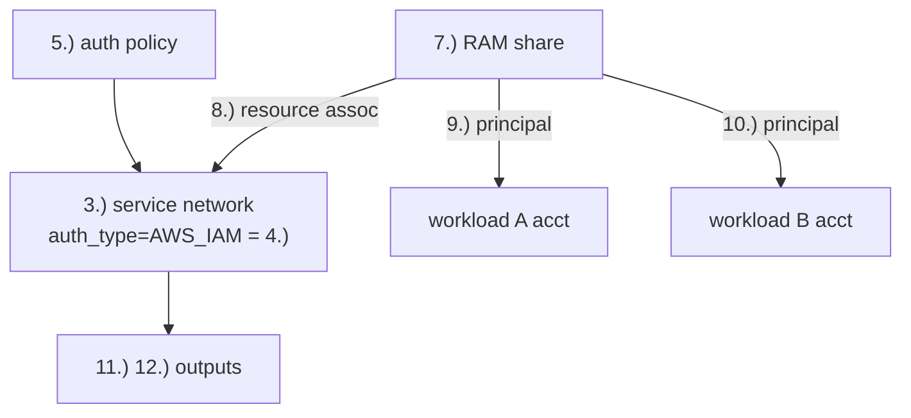

# crit-explain

Turn a diff into a guided reading experience: a reviewer opens crit and, by reading the numbered comments in order, understands the whole change from its dependency root outward — not by scanning files top-to-bottom.

## Core principles (non-negotiable)

- **Explain, don't critique** — explain WHAT each resource/definition does and WHY it exists. Do not hunt for problems or critique. (For critique use `$critique`/`/code-review`.)
- **Japanese comment prose** — write the explanatory prose in Japanese; section headings and role labels use the English templates below. Code, identifiers, commands stay verbatim.
- **Map structure is mandatory** — always produce (a) one review-level overview comment and (b) dependency-ordered numbered line comments prefixed with a grep-friendly ASCII token — `1.)` `2.)` `3.)` … (not circled glyphs like ①②③, which are hard to grep and type). Never a flat pile of unordered notes.
- **Lead with a diagram** — the overview comment must embed at least one unicode box-art diagram that makes the structure graspable at a glance. Text alone is not enough. Generate it locally with `scripts/mermaid_to_boxart.py` (crit does not render mermaid).
- **Comments only** — never edit `.tf`/source files, never commit/push. Annotations live in crit, not in code.
- **`--author 'Claude Code'`** on every comment.
- **Lock the base, keep it sticky** — establish the diff base (commit/branch) up front, asking the user when it is not explicit, then reuse that SAME base for every crit (re)launch. A daemon restart must reopen with `--range <base>..HEAD`, never `crit --session` (which silently re-derives the diff against the repo main branch).
- **Persist by default, re-persist on every change** — the crit session is volatile; snapshot the review into `<worktree-root>/.local/crit/` after the initial authoring AND after every subsequent mutation (each reply, `--clear`+re-add, resolve, surgical `review.json` edit). The snapshot must always reflect the latest state. Not optional.

## Inputs / target detection

Mirror `crit`'s auto-detection. Pass the user's argument straight through:

- no arg → current branch diff (`crit`)
- `--range <base>..<head>` → commit range
- `--pr <num|url>` → GitHub PR
- explicit files/dir → those paths

Use the SAME target for reading the diff and for launching crit, so comment line numbers line up.

**Ask for the base when it is not explicit.** If the user did not pass an explicit `--range`/`--pr`/paths (e.g. "explain this diff", or a bare branch), do not silently default to the branch-vs-main diff — confirm the base first: *"Which commit/branch should be the base?"*. Once decided, record it (e.g. `BASE=<sha-or-ref>`) and treat `<BASE>..HEAD` as the canonical target for the whole session. If the user gave an explicit base, echo it back so the base is on record. Every later launch/relaunch uses this exact `--range`, so the base never drifts across restarts.

## Workflow

### 1. Read the diff and build the dependency chain

- Get the changed files (`git diff --stat <range>` or `git diff <range> -- <path>`), then read the core files in full.
- Identify the **dependency root** — the resource everything else references (e.g. the primary resource other resources point their `*_arn`/`*_id`/`resource_identifier` at) — and trace outward: prerequisites → central resource → things attached to it → things sharing/exposing it → outputs consumed downstream.
- **Auto-select core resources**: the resource definitions that carry the change's intent. Skip noise (lockfiles, `Makefile`, `Dockerfile`, `.gitignore`, generated backend files) — reference them only in the overview map, don't line-comment them.
- Read neighboring context files (e.g. `locals.tf`, referenced variables) so comments are accurate, even if they aren't commented on.

### 2. Launch crit first, then lock the session identity

**Launch before authoring.** Read the `crit:crit` skill. Launch with
`run_in_background: true`, using the locked base target:

```bash
crit --range <BASE>..HEAD   # or: crit --pr <n>   (never `crit --session <id>` — it drops the base)
```

Wait for the `http://localhost:<port>` line, then relay it verbatim:

> **Crit is open at http://localhost:<port>. Read the 1.) 2.) 3.) … comments in order to grasp the whole change.**

Launching first is deliberate and removes two problems at once: comments cannot land
in a different review file than the live daemon, and the session id — hence the
persist path that Step 3's `## Session` block must carry — is already known, so no
after-the-fact patching is needed.

With the daemon up, resolve and record the identity before authoring anything:

```bash
crit status --json          # .review_file → ~/.crit/reviews/<session-id>/review.json
```

Derive `SID=$(basename "$(dirname "$REVFILE")")` and the persist destination
`<worktree-root>/.local/crit/$SID/review.json`. Verify the served base now, not later
(see the base-verification gotcha): the live truth is `/api/session`, not `review.json`.

Any time the daemon is restarted (after `crit stop`, a config fix, etc.), reopen with
the SAME `--range <BASE>..HEAD` — not `--session` — and re-verify the base.

### 3. Author the comments via crit-cli

Read the `crit:crit-cli` skill for exact CLI syntax. Author everything in one atomic `--json` batch. Write the JSON to a temp file (bodies are multi-line Japanese) and run:

```bash
crit comment --json --file <tmp>.json --author 'Claude Code'
```

**a. Overview comment (`scope: "review"`)** — the map. Structure it with these sections:

- `## Session` — **required, placed first (right after the H1 title)**. Two lines: the absolute path of the persisted snapshot (`<worktree-root>/.local/crit/<session-id>/review.json`, resolved in Step 2) and the diff range (`<base>..<head>`, e.g. `<BASE>..HEAD`). This makes the base and the persistence location visible to any reader opening the review. Because Step 2 already resolved the session id, write the real values here on the first pass — no backfill. Keep it in sync if either changes (re-run the surgical edit).
- `## Background` — why this change exists / what problem it addresses
- `## Structure` — **at least one unicode box-art diagram** visualizing the structure (see below). Put it early so the reader gets the shape before the prose.
- `## Overview` — the shape of the change; if multi-component, how the pieces relate
- `## File roles` — one line per changed file (including the noise files, so the reader knows what to skip)
- `## Key points` — the 3–5 things that actually matter (key flags, guards, invariants, "CP1 is loose, CP2 tightens" style notes)
- `## Reading order` — the dependency-ordered route, naming the numbered anchors: `1.) prerequisite → 3.) center → 5.) … → 11.) handoff`

State explicitly that the `1.)` `2.)` `3.)` … prefixes on line comments follow this route.

**Box-art diagram (required).** Author the structure as a Mermaid **flowchart**, convert it to static unicode box-art with the bundled local script, and paste the OUTPUT into the comment inside a plain ```` ``` ```` fence. Crit does not render mermaid — box-art renders anywhere monospace, so the diagram must be pre-rendered. See `references/boxart.md` for the supported subset and limits.

Authoring the flowchart:
- **Dependency / relationship graph** (`flowchart TD` or `graph LR`) — the default and the only shape the converter renders. Show core resources as nodes and their references as edges (who points its `*_arn`/`*_id` at whom), and tag each node with its reading number so the diagram doubles as the route: `SN["3.) service_network"]`. `subgraph` borders are NOT drawn — encode cross-boundary grouping (accounts, VPCs, stacks) in the node label, e.g. `SN["3.) service network (owner)"]`.
- Keep labels short (use `<br/>` for a second line); put Japanese explanation in the node text, not in comments.
- Prefer one clear diagram of <= ~10 nodes; the reading route must be reinforced by the layout, not contradicted.
- For a genuinely sequence- or state-shaped change, hand-author the box-art directly (still inside a plain ```` ``` ```` fence); the converter only does flowcharts.

Convert (write the flowchart to a temp `.mmd`, then run the skill-local script):

```bash
python3 <skill-dir>/scripts/mermaid_to_boxart.py /tmp/diagram.mmd
```

Embed the STDOUT verbatim in the overview body inside a plain ```` ``` ```` fence (JSON-escape the newlines for the `--json` batch).

Example — this flowchart:


```mermaid
flowchart TD
  AP["5.) auth policy"] --> SN["3.) service network<br/>auth_type=AWS_IAM = 4.)"]
  RS["7.) RAM share"] -->|"8.) resource assoc"| SN
  RS -->|"9.) principal"| A["workload A acct"]
  RS -->|"10.) principal"| B["workload B acct"]
  SN --> OUT["11.) 12.) outputs"]
```

converts to the box-art you paste (plain fence):

```
                ┌─────────────────┐    ┌───────────────┐
                │ 5.) auth policy │    │ 7.) RAM share │
                └─────────────────┘    └───────────────┘
             ┌───────────┘                     │
             ┌─────────────────────────────────│ 8.) resource assoc
             │                          ┌──────│ 9.) principal
             │                          │      └───────────────┐ 10.) principal
             ▼                          ▼                      ▼
┌─────────────────────────┐    ┌─────────────────┐    ┌─────────────────┐
│   3.) service network   │    │ workload A acct │    │ workload B acct │
│ auth_type=AWS_IAM = 4.) │    └─────────────────┘    └─────────────────┘
└─────────────────────────┘
             └──────────────────────┐
                                    ▼
                          ┌───────────────────┐
                          │ 11.) 12.) outputs │
                          └───────────────────┘
```

**b. Line comments** — one per core resource, in dependency-chain order. Each body:

- starts with the grep-friendly number prefix + a role label: `1.) [Prerequisite: …]`, `3.) [Dependency center: …]`, `11.) [Downstream handoff: …]` (prefix leads the body so `grep '^3\.)'` jumps straight to it)
- explains WHAT + WHY concisely
- ends with a navigation pointer to the next step: `→ next: 5.)` (omit on the last one; instead close the loop, e.g. "loop complete")
- anchors to real file line numbers (1-indexed, on-disk), single line or `start-end` range

Number continuously across files following the reading route, not the file listing order.

### 4. Persist the review (default)

The daemon and its review file under `~/.crit/reviews/` are volatile — snapshot the session into the target worktree so the annotated reading map survives daemon death. Do this by default; do not ask.

```bash
WT=$(git rev-parse --show-toplevel)
REVFILE=$(crit status --json | python3 -c 'import sys,json;print(json.load(sys.stdin)["review_file"])')
SID=$(basename "$(dirname "$REVFILE")")
DEST="$WT/.local/crit/$SID"
mkdir -p "$DEST"
cp "$REVFILE" "$DEST/review.json"
printf '*\n' > "$WT/.local/.gitignore"   # keep the snapshot out of git
```

- Snapshot the live `review.json` to `<worktree-root>/.local/crit/<session-id>/review.json`.
- Write `<worktree-root>/.local/.gitignore` = `*` so the snapshot is never accidentally committed.
- Drop a short restore note next to it: session id, `base_ref`, and the restore command.
- **Restore** = copy `review.json` back to `~/.crit/reviews/<session-id>/review.json`, then `crit --range <BASE>..HEAD` (never `--session`).
- **Re-persist on every change (explicit flow)**: the snapshot is point-in-time, so re-run this copy after *any* session mutation — the initial `--json` batch, every reply you post, every reviewer reply you fetch/answer, any `--clear`+re-add, any resolve, and any surgical `review.json` edit. Treat "authored/edited a comment" and "re-copied the snapshot" as a single unit of work; never leave the persisted copy stale.
- **Recovery only — commented before launching?** Following Step 2 → Step 3 order, the session id is known before authoring, so `## Session` is already correct and nothing needs patching. If comments were written before the daemon came up, two repairs are needed: (a) the batch may have landed in a different review file, so check `crit comments --json` against the live daemon and re-run the same `--json` batch if it returns `null`/empty; (b) `## Session` carries a placeholder, so patch it with the surgical `review.json` edit (`crit stop` → edit → `crit --range <BASE>..HEAD` → re-persist).

### 5. Report

List every comment added as `file:line — one-line topic`, plus the overview. State the locked base (`<BASE>..HEAD`) and the persist path. Note that source files were not modified.

## Gotchas

- **Comment paths must be repo-root-relative**: crit keys line comments by the diff's file paths, which are relative to the **git repo root** (e.g. `aws/infrastructure/sandbox-lattice/workload-a/lattice.tf`). If you author from a subdirectory using cwd-relative paths (`workload-a/lattice.tf`), `crit comment` still reports success and the entries show in `crit comments`, but they DO NOT attach to the diff view — they look "missing". Always set `file`/`path` to the repo-root-relative path. After the batch, verify with `crit comments --all --json` that every path starts with the repo-relative prefix seen in `git diff --stat`.
- **`review.json`'s `base_ref` is NOT the served range — verify the base against `/api/session`**: the file-layer `base_ref` and the range the daemon actually serves are separate values, and they disagree **in both directions**. `crit --session <id>` re-derives the served diff against the repo main branch while `review.json` still stores the correct base (the UI shows "against master" — always relaunch with `crit --range <BASE>..HEAD` instead). The reverse also happens: `review.json` never stores the ref you passed — it stores a *resolved sha*, measured to be the merge-base against `origin/master`, whose diff can span an order of magnitude more commits than your base while the daemon serves the right range. Reading `review.json` alone in that case produces a false "the base was dropped" alarm. Do not fix this by comparing the sha to a merge-base you compute yourself — that mapping is not guaranteed to hold. The live truth is the daemon:

  ```bash
  ps aux | grep 'crit _serve'                    # confirm --range is on the argv
  PORT=$(lsof -a -p <serve-pid> -iTCP -sTCP:LISTEN -P -n | awk 'END{split($9,a,":");print a[2]}')
  curl -s "http://localhost:$PORT/api/session"   # .base_ref = served base, .files = served file list
  ```

  Base is correct when `/api/session` `.base_ref` equals `<BASE>` **and** `len(.files)` matches `git diff --stat <BASE>..HEAD`. Do not report a base problem on `review.json` evidence alone.
- **Bare flags become comment bodies**: `crit comment <anything-unrecognized>` is treated as adding a review comment with that text — e.g. `crit comment --help` posts a comment whose body is `--help`. Read help via `crit --help` (or `crit <subcmd> --help` only if documented), never `crit comment --help`.
- **No per-comment delete — surgical fix**: `crit comment --clear` removes ALL comments (including the reviewer's), so it is unusable once a review round has started. To remove junk or re-path specific comments without data loss: `crit stop` → back up and edit `~/.crit/reviews/<session-id>/review.json` directly (re-key `files.<path>` entries, drop unwanted `review_comments`) → relaunch with `crit --range <BASE>..HEAD`. Never edit `review.json` while the daemon is running — it owns the file and will clobber your edit on the next mutation.
- **Review-file mismatch**: `crit comment` targets the active daemon session when one is running, but the branch-diff review file and a `--range` review file differ. If you commented *before* launching, `crit comments --json` on the live session may return `null`/empty — re-run the same `--json` batch after the daemon is up. Confirm with `crit status`.
- **No edit command**: to revise bodies, `crit comment --clear` then re-add the full batch (clears everything — see the surgical-fix note above for revising in the middle of a round). There is no per-comment body edit.
- **Bulk atomicity**: always use one `--json` batch for 3+ comments (single write, no partial state).

## Hard constraints

- Do not edit or modify any source file.
- Do not `git commit`/`push`, and do not write to any issue tracker or notes.
- Comment only on the core resources that carry the change's intent.
