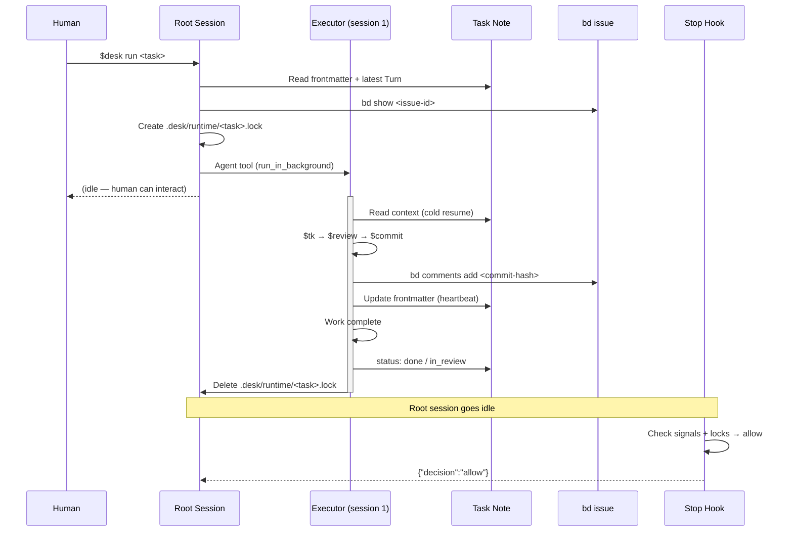
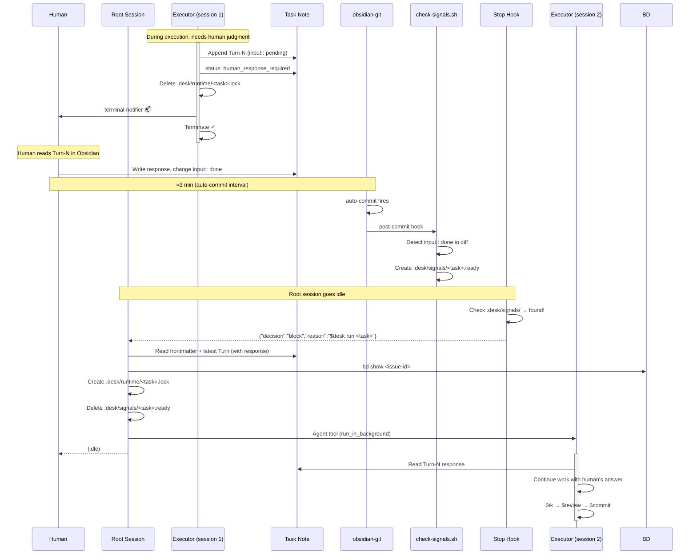
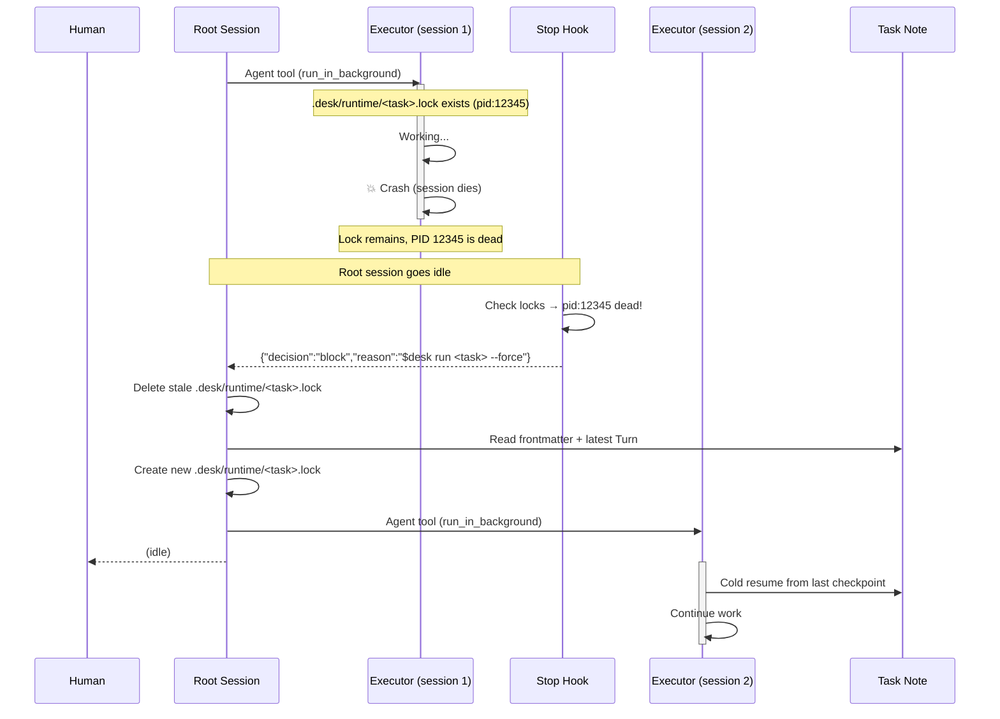
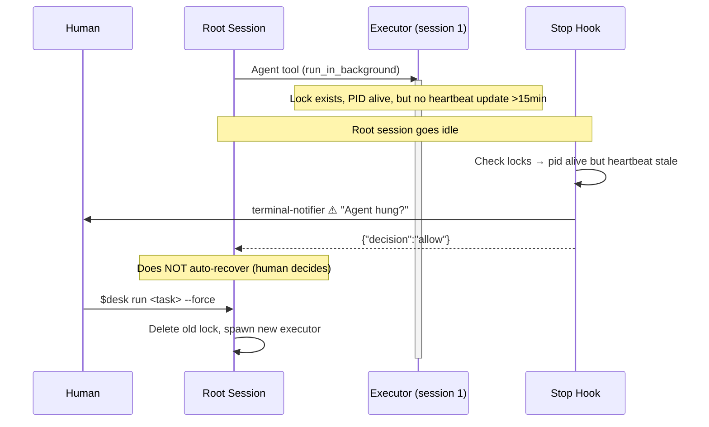
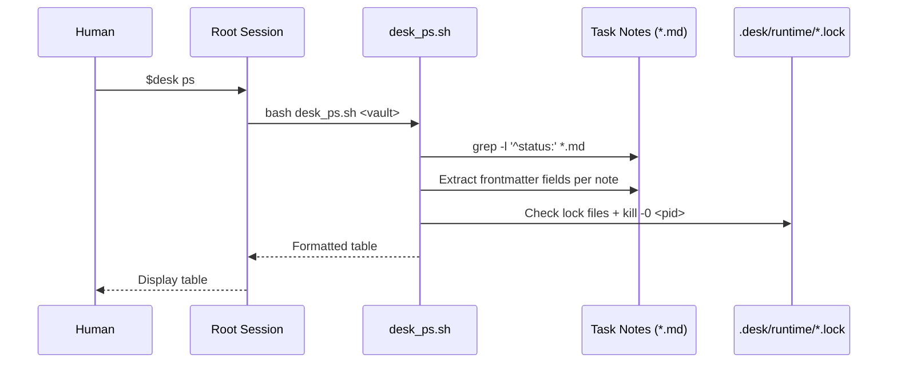

# Desk Sequence Diagrams

## 1. Normal Execution Flow (happy path)



## 2. Human Input Required → Cold Resume



## 3. Agent Crash → Auto-Recovery



## 4. Heartbeat Stale → Notification (no auto-action)



## 5. $desk ps — Observability



## 6. Full Lifecycle (Init → Done)

```mermaid
sequenceDiagram
    participant H as Human
    participant R as Root Session
    participant P as Planner
    participant E as Executor(s)
    participant TN as Task Note
    participant BD as bd issue

    H->>R: $desk new
    R->>TN: Create note (status: plan_ready)
    R->>BD: bd create epic

    H->>R: $desk run <task>
    R->>P: Spawn planner
    activate P
    P->>TN: Write Q-1..Q-N (status:: unanswered)
    P->>P: Terminate
    deactivate P

    Note over H: Async: answer questions in Obsidian
    Note over H,R: ... signal → Stop Hook → cold resume ...

    R->>P: Spawn planner (cold resume)
    activate P
    P->>TN: Write Snapshot + Plan + Milestones
    P->>TN: status: in_progress
    P->>P: Terminate
    deactivate P

    loop Cold resume chain (N sessions)
        Note over R: Stop Hook or $desk run
        R->>E: Spawn executor
        activate E
        E->>E: $tk → $review → $commit
        E->>BD: Checkpoint notes
        alt Human input needed
            E->>TN: Turn-N (input:: pending)
            E->>E: Terminate
            deactivate E
            Note over H: Respond → signal → resume
        else Work unit done
            E->>TN: Update milestones
            E->>E: Terminate
            deactivate E
        end
    end

    Note over R: All milestones complete
    R->>E: Spawn finisher
    activate E
    E->>TN: Final Turn-N (human check gate)
    E->>E: Terminate
    deactivate E

    H->>TN: Approve (input:: done)
    Note over H,R: ... signal → Stop Hook ...
    R->>E: Spawn finisher (cold resume)
    activate E
    E->>BD: Close epic
    E->>TN: status: done
    E->>E: Terminate
    deactivate E
```

## Message Types Summary

| channel | direction | sync/async | mechanism |
|---------|-----------|------------|-----------|
| Human → Root | sync | human types in CLI | direct input |
| Root → Executor | async | Agent tool (background) | spawn + terminate |
| Executor → Human | async | Turn-N in task note | obsidian notification |
| Human → Executor | async | input:: done → signal → cold resume | obsidian-git → hook → Stop Hook |
| Stop Hook → Root | sync | block + reason injection | hooks.Stop JSON |
| Executor → bd | sync | bd comments add | CLI within session |
| Executor → Task Note | sync | file write | Edit/Write tool |
